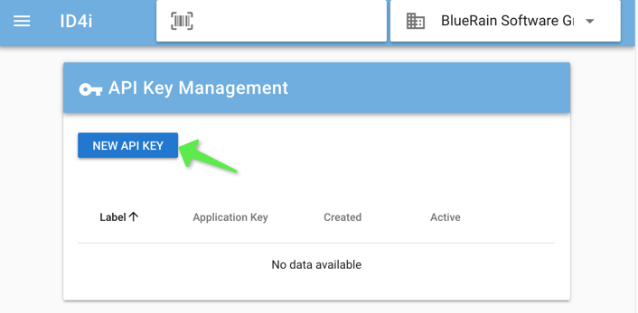
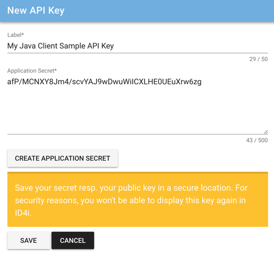
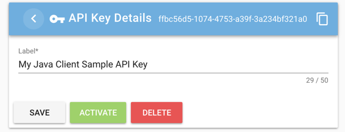

= ID4i API Client Example - Java

This repository contains an example API Client for http://id4i.de.
For detailed documentation of ID4i see https://backend.id4i.de/docs/reference/en/reference.html

== Prerequisites

* Java 1.8
* Maven >= 3.5.0

== Preparation

To be able to connect to ID4i with an API client, you need to register and set up an API key for
your application first. Using this key, you can sign https://jwt.io/[JWTs] to send as `Authorization` header for
subsequent requests.

. If you do not already have an ID4i account, please register at https://backend.id4i.de and log in.
. Navigate to `API Keys` and select `New API Key`
+

. Give your key a label and enter an application secret (or let the application generate one for you). footnote:[When using asymmetric signing, you would use your public key here.]
+

. Save your secret resp. your public key in a secure location.  For security reasons, you won't be able to display
this key again in ID4i.

. Activate the key on the details page
+

WARNING: Do not store your API Keys and Secrets with the source code of your application. Either supply the key as a configuration property of your application or retrieve it from your own server when required in the
application. Use a separate API Key for each deployment of your application.

Now clone this repository and you are good to go.

== Build

== Run

== Contribute

