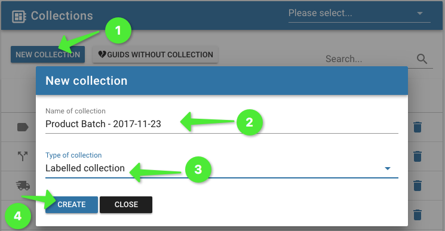
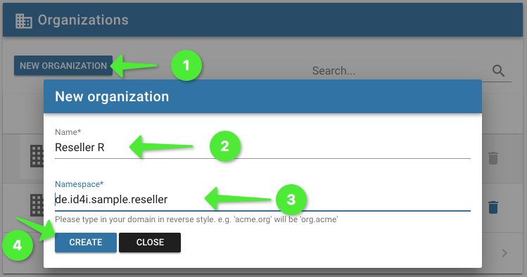

image:https://img.shields.io/circleci/project/github/BlueRainSoftware/id4i-api_client-sample-java.svg[CircleCI,link=https://circleci.com/gh/BlueRainSoftware/id4i-api_client-sample-java]
image:https://img.shields.io/gitter/room/nwjs/nw.js.svg?label=Support%20Chat[Support Chat,link=https://gitter.im/BlueRainSoftware/support]
image:https://img.shields.io/maven-central/v/de.id4i.api/id4i-api-client.svg?label=API%20Client%20Library[API Client Version, link=http://search.maven.org/#search%7Cga%7C1%7Ca%3A%22id4i-api-client%22]

= ID4i API Client Example - Java

ID4i provides globally unique IDs for single workpieces and a platform to manage, and exchange data bound to IDs in an inter-organizational manner. For details, please refer to http://id4i.de.

This repository contains all example Java API Client for ID4i.
For detailed documentation of ID4i see https://backend.id4i.de/docs/reference/en/reference.html#_tutorials

== Prerequisites

* Java 1.8
* Maven >= 3.5.0

== Preparation

To be able to connect to ID4i with an API client, you need to register and set up an API key for
your application first. Using this key, you can sign https://jwt.io/[JWTs] to send as `Authorization` header for
subsequent requests.

. If you do not already have an ID4i account, please register at https://backend.id4i.de and log in.
. Navigate to `API Keys` and select `New API Key`
+
.New API Key
image::img/readme-new-api-key.png[]
. Give your key a label and enter an application secret (or let the application generate one for you). footnote:[When using asymmetric signing, you would use your public key here.]
+
.API Key Label and Secret


. Save your secret resp. your public key in a secure location.  For security reasons, you won't be able to display
this key again in ID4i.

. Activate the key on the details page
+
.API Key Activation


WARNING: Do not store your API Keys and Secrets with the source code of your application. Either supply the key as a configuration property of your application or retrieve it from your own server when required in the
application. Use a separate API Key for each deployment of your application.

For some tutorials, you will need also additional GUID collections, more than one API key and further organizations. These can be either created
programmatically using the API or via the user interface as shown below.

To create the *labelled collection* called `Product Batch`, use `Menu -> Collections -> New Collection (Product Batch, Labelled Collection)`.

.New Collection


To create an organization: `Menu -> Organizations -> New Organization (Reseller)`.

.New Organization



Now clone this repository and you are good to go.

Please note that with the default settings, you will connect to the ID4i production system. Have a look into https://backend.id4i.de/docs/reference/en/reference.html#_how_to_implement_an_api_client_in_java
for more details.

== Build

`mvn install` should do what you expect it to.
Use it in the root module to build all clients or in each client module (i.e. sub-directory) separately.

Note that there is some redundancy within the client modules. This is a deliberate decision to have
them self contained in an independent manner, so you have a standalone project for each tutorial without
additional shared code/build script.

== Run

Each sample (module) has to be run separately.

Before running a sample, you need to set at least two environment variables to tell the app which API key and secret to use:
`ID4I_API_KEY` and `ID4I_API_KEY_SECRET`. During development you will typically do this in your IDEs run configuration.

Having built the jar, you can just run it.

See the description of the individual modules for additional instructions.

```
$ cd first-client
$ ID4I_API_KEY=19323ddfc-27a2-43cd-ad51-bfe23a87b32234f
$ ID4I_API_KEY_SECRET=qaSdm4G94ojfsdklmUW7VIw3RJeYinKkxBu/6z8Sjvlsz2+X"
$ java -jar target/id4i-api-client-sample-java-1.0-SNAPSHOT-jar-with-dependencies.jar
```

== Contribute

If you have samples to contribute, feel free to open a PR (and/or contact us).
If something does not work for you, please raise an issue in this repository.
If you need other examples, let us know which by also opening an issue here.

