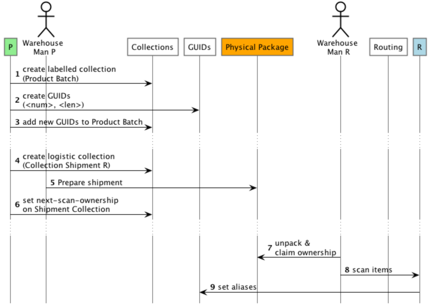

= ID4i API Client Example 2 - Working with GUIDs and Collections

This module implements a first ID4i API client as described in the GUID and Collections tutorial
at https://backend.id4i.de/docs/reference/en/reference.html#_how_to_work_with_guids_and_collections_using_the_java_api.

The process we are going to implement in this tutorial is shown below.



The instructions on how to build and run this example is in  the parent module's README.

== Run

As opposed to tutorials in which only one organiztion works with the API, we have to set different environment variables:
the API key and secret for both organizations (Producer and Reseller) and their respective organization IDs. 
See the root module README and the developer guide for details on how to set up the prerequisites in ID4i.

```
$ PRODUCER_ID4I_ORGA = <Organization ID, Long>
$ PRODUCER_ID4I_API_KEY = <API Key, String>
$ PRODUCER_ID4I_API_KEY_SECRET= <API Key Secret, String>
$ RESELLER_ID4I_ORGA = <Organization ID, Long>
$ RESELLER_ID4I_API_KEY = <API Key, String>
$ RESELLER_ID4I_API_KEY_SECRET= <API Key Secret, String>
$ java -jar target/api-client-java-guids-1.0-SNAPSHOT-jar-with-dependencies.jar
```
